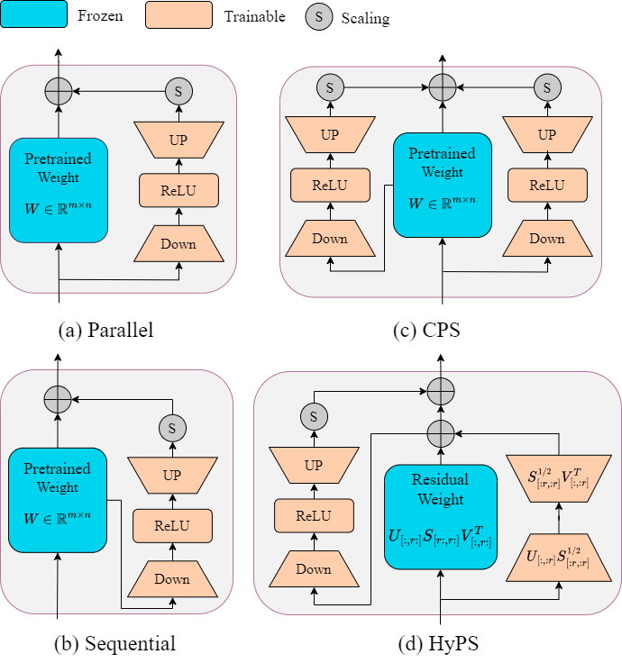

# HyPS
A Novel Hybrid Parameter-Efficient Fine-Tuning Approach for Hippocampus Segmentation and Alzheimer’s Disease Diagnosis


# Contact
if you have any question about our project, please feel free to contact us by email at wgcheng0@gmail.com

# Environment install
Clone this repository and navigate to the root directory of the project.
```python
git clone https://github.com/WangangCheng/HyPS.git
cd HyPS
pip install -r requirements.txt
```
Note: Our cuda version is 12.4, You can install pytorch from this [link](https://pytorch.org/).

# Data downloading
1. You can download the pre-trained weights at this [Link](https://drive.google.com/file/d/11GtGNvK1DOK__-B_ab7VvDCQVGkp6ilO/view?usp=drive_link), You can download the pre-trained weights from this link and put them in the `checkpoint/SwinUNETR2023-11-04`.

2. Download our processed EADC data from Google Drive [Link](https://drive.google.com/file/d/1NY3ItOdsptI2lZ_iYvKR9PC6ApHSfdw7/view?usp=sharing), Or you can also get the source data on the official website [EADC](http://adni.loni.usc.edu/).

3. Download the LPBA40 dataset You can get it from this [Link](https://www.loni.usc.edu/research/atlas_downloads).

4. Download the HFH dataset You can gei it from this [Link](http://www.radiologyresearch.org/HippocampusSegmentationDatabase/).

## Data storage
The data storage location should follow the following method
- Datasets/
  - EADC/
    - sub1/
      - sub1_img.nii.gz
      - sub1_mask.nii.gz
    - ...
    - sub135/
        - sub135_img.nii.gz
        - sub135_mask.nii.gz 
    - train.txt
    - valid.txt
    - test.txt

Note:The label is not matched the image in th fllowing subjects:002_S_0938 (sub8), 007_S_1304 (sub35), 016_S_4121 (sub65), 029_S_4279 (sub85), 136_S_0429 (sub134). Then, follow the instructions in the train.txt, valid.txt, and test.txt documents to set up your training set, validation set, and test set.

# Preprocessing
Before preprocessing, please modify the `your_path`
```python
cd data
python preprocess.py
```
After pre-process, sub{i}_data_f32b0.pkl will be generated in each sub{i} directory

# HyPS Training
```python
cd HyPS
python train_HyPS.py
```
After the training is completed, the trained weight file will be in `checkpointd/SwinUNETR2024-XX-XX`

# CPS Training
```python
cd HyPS
python trian_CPS.py
```
# HyPS Inference
Modify the time in test_HyPS.py, which is the training date
```python
python test_HyPS.py
```
The inference process loads the average of the last four epoch weights. If you don’t want this, you can set `multimodel=false` so that the inference process will load the weight file of the last epoch.

The inference results will be saved in the `output/submission`
# CPS Inference
```python
python test_CPS.py
```
# Evaluation
Before evaluation, you should modify the `your_path` part in dice.py and hd95.py files
```python
cd evaluation
python dice.py
python hd95.py
```
# Acknowledgement
If you find HyPS useful for your research and applications, please cite using this BibTeX:
```bibtex
@ARTICLE{2024arXiv240711292H,
       author = {Cheng, Wangang and He, Guanghua and Hu, Keli and Fang, Mingyu and Dong, Liang and Li, Zhong and Zhu, Hancan},
       title = "{A Novel Hybrid Parameter-Efficient Fine-Tuning Approach for Hippocampus Segmentation and Alzheimer's Disease Diagnosis}",
       journal = {arXiv preprint arXiv:2409.00884},
       year = 2024
}
```
